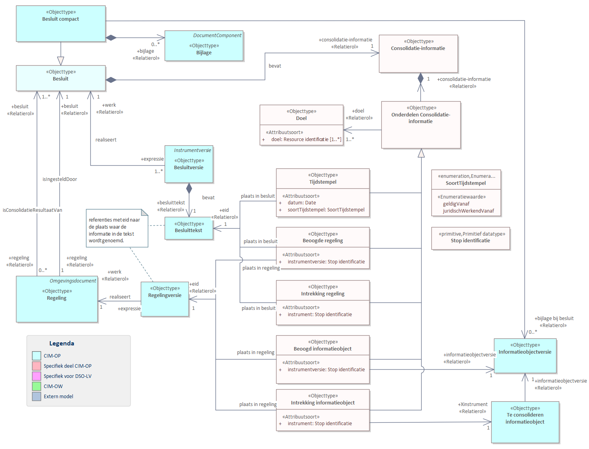

# Onderdelen van STOP relevant voor IMOW {#H06-OPinIMOW}

Dit hoofdstuk beschrijft STOP onderdelen die relevant zijn voor het IMOW. Enkele
dingen worden toegelicht vanuit OW-perspectief, omdat de samenhang met de
OP-standaard relevant is. [Paragraaf 6.1](#H06-ConsolidatieInformatie)
beschrijft de consolidatieinformatie uit een
Regeling. In [paragraaf 6.2](#H06-GIO) worden GIO’s beschreven. In [paragraaf 6.3](#H06-GML) staan regels voor het aanleveren van GML.

Zie de STOP [[STOPIC]] en het CIM-OP [[CIMOP]] voor meer details.

## ConsolidatieInformatie {#H06-ConsolidatieInformatie}

In het STOP deel van de aanlevering wordt ConsolidatieInformatie meegeleverd.
De ConsolidatieInformatie bepaalt de tijdlijn van de regelingen en
informatieobjecten die ontstaan uit een Besluit. Diezelfde tijdlijn geldt voor
de OW-objecten.

[Figuur 11](#fig-cim-op-consolidatie) toont de klasse 'Consolidatie Informatie' van het CIM-OP. Deze
bevat de informatie die noodzakelijk is om de aanlevering te consolideren tot
een Regeling. Voor IMOW zijn de volgende aspecten van belang:

- De klasse 'Beoogde regeling' bevat de identificatie van de te wijzigen Regeling.
  Deze identificatie moet overeenkomen met workIDRegeling in de OW-aanlevering.
- De relatie 'doel' verwijst naar het doelId in de OW-aanlevering.
- Uit de  klasse 'Tijdstempel' worden de geldigheidsgegevens van de OW-objecten afgeleid.

<figure id="fig-cim-op-consolidatie">
    
    <figcaption>Consolidatieinformatie in STOP</figcaption>
</figure>

## GIO’s en Norm GIO’s {#H06-GIO}

Bij het aanleveren van een besluit volgens STOP worden
geografische objecten aangeleverd als GIO’s (geografische informatieobjecten).
Dit is één van de twee soorten informatieobjecten die in STOP kunnen worden
meegeleverd (de andere zijn PDF-documenten). [Figuur 12](#cim-op-gio) bevat het UML diagram 
van de 'GIO versie' uit het CIM-OP. Voor IMOW zijn de volgende aspecten van belang:

- Een 'Gio vaststelling' stelt een versie van een GIO vast. Hierin heeft iedere
Geometrie een id attribuut in de vorm van een UUID. Wanneer in IMOW middels
GeometrieRef naar een Geometrie wordt verwezen wordt deze UUID gebruikt.
- Sommige GIO's bevatten informatie over normen.
- Een 'Gio vaststelling' bevat 'Geografische context' die informatie bevat over
  de context ten opzichte waarvan het GIO is vastgesteld.
- FRBRWork en FRBRExpression bevatten de identificatie van het GIO.
- Een GIO bevat één of meer Locatie objecten. Deze Locaties komen niet overeen
  met OW:Locatie ook de naam van de locatie is niet rechtstreeks gekoppeld.
- Wanneer in aanlevering van GIO's meedere keren exact dezelfde geometrie wordt gebruikt
  kan je in beide gevallen dezelfde UUID gebruiken. Het DSO zorgt er dan voor de
  geometrie slechts één keer wordt doorgeleverd.
- Indien er gebruik gemaakt wordt van groepen, dan dient iedere groep
 een symbolisatie te hebben (dit wordt vastgelegd in het vaststellingsdeel).
- Bij Norm-GIO’s dienen aanvullende gegevens vastgelegd te worden.

Indien er normen vastgelegd worden aan de OW-kant, dan bevat het
GIO 'Norm informatie' en de Locaties van het GIO bevatten
een 'Normwaarde'. Hiervoor geldt:

- Bij een kwantitatieve normwaarde bevat 'Eenheid ID' de eenheid van de normwaarde. 
  Hier moet een URI ingevuld worden uit de waardelijst ‘Eenheid’.
- 'Eenheid label' bevat dan het label die getoond dient te worden bij de eenheid.
- 'Norm ID': De URI uit waardelijst ‘TypeNorm.
- De naam van de Norm aan de OW-kant.
- De attributen 'Kwalitatief' en 'Kwantitatief' moeten overeenkomen met de
 gelijknamige kenmerken in OW.
- Hoewel de Geometrie gedeeld wordt tussen STOP en OW-objecten geldt dit
  niet voor de norm-gegeven. Deze worden dus twee keer uitgewisseld maar
 moeten wel met elkaar overeenkomen.
- Het is toegestaan om een geometrie die gebruikt wordt voor een Norm ook te 
  gebruiken bij andere OW-objecten.
- Iedere normwaarde dient een symbolisatie te hebben, dit wordt vastgelegd
  in het vaststellingsdeel van het GIO. <!-- TODO: dit zie ik nog niet terug in CIM-OP -->

<figure id="fig-cim-op-gio">
    </img>
    <figcaption>GIO in STOP</figcaption>
</figure>

## Regels voor het aanleveren van GML {#H06-GML}

OW Geometrie objecten worden aangeleverd via het GIO in GML. Voor de
aangeleverde GML gelden de volgende regels:

- De GML-specificaties volgen de regels van de standaard Basisgeometrie [[BASISGEO]].
- Het bijbehorende GML applicatieschema Basisgeometrie.xsd is gepubliceerd op:
<https://register.geostandaarden.nl/gmlapplicatieschema/basisgeometrie/1.0.0/>
- Voor aanlevering van het GML wordt gebruik gemaakt van GML 3.2.2 met
Simple features profile 0.
- Coördinaatreferentiestelsel: Het is verplicht om de srsName in te vullen
op het hoogste niveau van een geometrie. Dat betekent dat van een samengestelde
geometrie, een multi-geometrie, alleen op het niveau van de samenstelling de
srsName verplicht is ingevuld. Invul-instructie:
    - RD stelsel (2D): srsName="urn:ogc:def:crs:EPSG::28992"
    - ETRS89 (2D): srsName="urn:ogc:def:crs:EPSG::4258"
- Voor implementatie in GML zijn er aanvullende specificaties als
het gaat om het invullen van een gml:id attribuut. Dit gml:id attribuut heeft
geen informatiewaarde maar is nodig om interne en externe referenties te
realiseren voor gebruik binnen het gml formaat. Voor de GML 3.2.1 was dit een
verplicht element maar voor GML 3.2.2 is dit optioneel. Indien de optionele gml:id
wordt toegepast dient deze globaal uniek te zijn en
mag de waarde conform de gml specificaties alleen met een letter of een
underscore beginnen.
- Coördinaten opgenomen bij een geometrie
worden standaard uitgewisseld met een nauwkeurigheid van 1 mm of het
equivalent daarvan in graden. Voor RD, NAP en ETRS89 komt dat overeen met de
volgende nauwkeurigheden:
    - RD in meters 3 decimalen (1 mm);</li>
    - NAP-hoogte in meters 3 decimalen (1 mm);</li>
    - ETRS89-breedte in graden 8 decimalen (1,1 mm)
    - ETRS89-lengte in graden 8 decimalen (0,7 mm)
    - ETRS89-hoogte in meters 3 decimalen (1 mm)

Het functioneren van de landelijke voorziening wordt gewaarborgd door geometrie die ver buiten Nederland en exclusieve economische zone ligt te weigeren.

**Regel:** Alle geometrieën in een omgevingsdocument moeten liggen binnen de geometrie van Nederland met inbegrip van de exclusieve economische zone (EEZ).

OZON valideert hierop door een geometrie die buiten en naar buiten afgeronde bounding box rondom het genoemde gebied ligt te weigeren.
