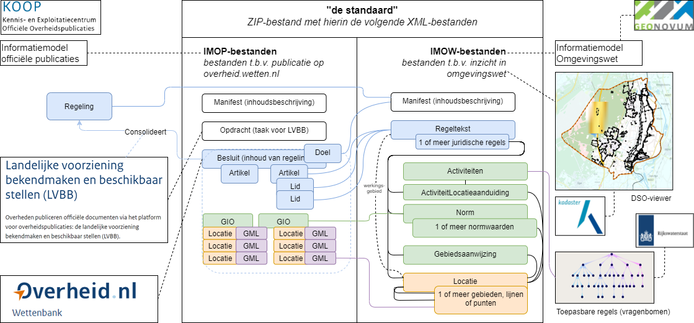

# Inleiding {#3FE27A0C}

Dit document beschrijft het Informatiemodel Omgevingswet (IMOW) over het in de keten van plan tot publicatie toekennen van machine-leesbare informatie aan Regelingen. Het IMOW implementeert het conceptuele model CIM-OW. CIM-OW hoort bij de reeks conceptuele modellen waarop de ketens van het Digitaal Stelsel Omgevingswet (DSO) gebaseerd zijn. Het IMOW legt vast welke objecten aan het DSO kunnen worden aangeleverd. 

In paragraaf <a href='#7148BD3C'>1.1</a> wordt een context geboden van de standaard. Paragraaf <a href='#6AB1D937'>1.2</a> verwijst naar de versies van standaarden die gebruikt zijn voor deze standaar. Paragraaf <a href='#28F55C8C'>1.3</a> bevat de leeswijzer. 
## Context standaard {#7148BD3C}

Wanneer je in de context van de Omgevingswet als bevoegd gezag een Regeling (bijvoorbeeld een Omgevingsplan) wilt wijzigen doe je dit via een aanlevering aan de LVBB, de landelijke voorziening bekendmaken en beschikbaar stellen. Vrijwel altijd bevat die aanlevering een Besluit. De structuur van de aanlevering is vastgelegd in verschillende standaarden: 
<ul><li>Het <a href='https://koop.gitlab.io/lvbb/bronhouderkoppelvlak/' target='_blank'>LVBB bronhouderkoppelvlak</a> schrijft voor welke bestanden er in de aanlevering moeten zitten wat voor eisen er zijn aan de namen van de bestanden etc.</li>
<li>De <a href='https://koop.gitlab.io/STOP/standaard/index.html' target='_blank'>STOP</a> standaard legt de documentstructuur van de tekst van het besluitdeel van de aanlevering vast. Ook beschrijft deze standaard veel metadata voor de verwerking van het besluit. Verder beschrijft de STOP standaard hoe geografische informatieobjecten (GIO’s) moeten worden aangeleverd.</li>
<li>Het <a href='https://www.geonovum.nl/geo-standaarden/omgevingswet/STOPTPOD' target='_blank'>IMOW</a> (dit document) beschrijft hoe de tekstonderdelen van een regeling te annoteren zijn, zodat ze beter verwerkt (en op een kaart getoond) kunnen worden in het DSO. Een annotatie bestaat uit een OW-object  dat gekoppeld is aan identificeerbare onderdelen van de tekst. Het IMOW is bedoeld voor het realiseren van functionaliteit ten behoeve van het bevragen van een regeling in DSO-verband. Data zijn hiervoor bezien van uit geografisch perspectief. Bij een IMOW-aanlevering kun je denken aan het duiden van specifieke activiteiten op de kaart of het meeleveren van functies of beperkingengebieden. De gegevens die aangeleverd worden vanuit het IMOW helpen de buitenwereld in met het op een kaart terugvinden van Omgevingswet-. Dit document beschrijft hoe annotaties bij een besluit aangeleverd dienen te worden en hoe je aanlevert conform de set van IMOW.xsd’s. Deze XSD’s (XML-schema’s) worden gebruikt voor de beschrijving van XML-gebaseerde gegevensuitwisseling in het DSO. Het IMOW implementeert de objecten beschreven in het CIM-OW.</li>
<li>In het CIM-OW (conceptueel informatiemodel Omgevingswet) staat beschreven welke objecttypen het IMOW kent en hoe deze zich tot elkaar verhouden. Het CIM-OW is het leidende informatiemodel voor informatie-uitwisseling binnen het DSO.</li>
<li>Toepassingsprofielen omgevingsdocumenten (TPOD’s). Per type omgevingsdocument is er ook een set aanvullende regels specifiek voor dat type omgevingsdocument. In de TPOD’s is opgenomen hoe die toegepast moeten worden. Toepassingsprofielen voor omgevingsdocumenten (TPOD's) beschrijven de juridische en informatiekundige context voor de specifieke omgevingsdocumenten. Voor onder meer de volgende typen omgevingsdocumenten zijn toepassingsprofielen gepubliceerd:<ul><li>Omgevingsplan (het omgevingsdocument dat gemeenten aanleveren, het voormalige bestemmingsplan)</li>
<li>Omgevingsverordening (het omgevingsdocument dat provincies aanleveren, de voormalige provinciale verordening)</li>
<li>Waterschapsverordening (het omgevingsdocument dat waterschappen aanleveren)</li>
<li>Algemene maatregelen van bestuur/ ministeriële regeling (AMvB/MR, de omgevingsdocumenten die worden aangeleverd vanuit het rijk)</li>
<li>Projectbesluit (het omgevingsdocument waarmee een specifiek project mogelijk wordt gemaakt)</li>
<li>Omgevingsvisie (het omgevingsdocument waarmee het bevoegd gezag een visie kan maken)</li>
</ul>

</li>
<li>De validatiematrix beschrijft regels waaraan aanleveringen dienen te voldoen. Dit document is zelf geen standaard maar is een opsomming van regels die in de standaarden beschreven staan en waar tegen gevalideerd kan worden</li>
<li>Voorbeeldbestanden van correcte aanleveringen. Deze geven inzicht hoe IMOP en IMOW technisch toegepast moeten worden om een nieuw omgevingsdocument aan te leveren.</li>
<li>Waardelijsten geeft aan wat de toegestane waardes zijn bij attributen van IMOW die aan een waardelijst gekoppeld zijn. Waardelijsten worden in de Stelselcatalogus (https://stelselcatalogus.omgevingswet.overheid.nl/waardelijsten) gepubliceerd.</li>
</ul>

<figure></img>
<figcaption>Schematisch overzicht van aanlevering conform de standaard</figcaption></figure>

## Normatieve referenties {#6AB1D937}

Dit document is gebaseerd op de versies van de volgende standaarden:
 - STOP Standaard (Versie STOP-IC)
 - LVBB Bronhouderkoppelvlak
 - CIM-OP
 - CIM-OW>

## Leeswijzer {#28F55C8C}

De rest van dit document is als volgt opgebouwd: hoofdstuk <a href='#320F8A13'>2</a> beschrijft het informatiemodel en zijn onderdelen. Verder wordt het informatiemodel in de context geplaatst van de standaard voor officiële publicaties. Hoofdstuk <a href='#5C716AFD'>3</a> bespreekt de technische implementatie en geeft hierbij aan welke bestanden er verwacht worden en beschrijft de randvoorwaarden voor het aanleveren. Hoofdstuk <a href='#3F5FA62D'>4</a> gaat gedetailleerd in op hoe de OW-bestanden er uit dienen te zien en geeft een XML-beschrijving van ieder bestand dat aangeleverd kan worden. Hoofdstuk <a href='#126CC8D0'>5</a> geeft weer waar het CIM-OW en IMOW afwijken. Hoofdstuk <a href='#2577D13E'>6</a> beschrijft enkele aspecten uit STOP die relevant zijn voor de werking van OW en geeft richtlijnen over de wijze waarop OW zich verhoudt tot STOP. Hoofdstuk <a href='#210F8E1C'>7</a> beschrijft het wijzigen van OW-objecten. 
